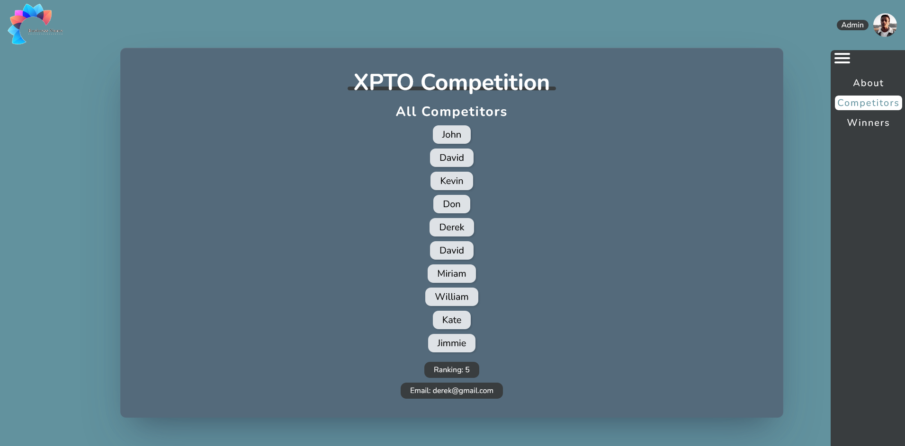

<h1 align="center">
  XTPO Competition
</h1>

<p align="center">
  
  
  
  
  

  <a href="https://github.com/humbruno/xpto-landing-react/commits/master">
    
  </a>
  
  <a href="https://github.com/humbruno/xpto-landing-react/issues">
    
  </a>
</p>

<p align="center">
  
</p>

## 💻 Project

React version of the landing page for XPTO Competition. This project was initially a Single-page Application created with vanilla JS, HTML & CSS and has now been refactored to React for a smoother experience.

Dependencies used for this project:

- [React](https://reactjs.org/)
- [React Router DOM v5](https://v5.reactrouter.com/web/guides/quick-start)
- [SCSS](https://sass-lang.com/)
- [SCSS Modules](https://github.com/css-modules/css-modules)

## 🔌 Live Website Link

- [Live Website](https://xpto-react.brunosantos.dev/)

## 📥 Installing and executing

Clone this repository and access the directory.

```bash
# Instaling dependencies
$ npm install

# Executing the application
$ npm start
```
